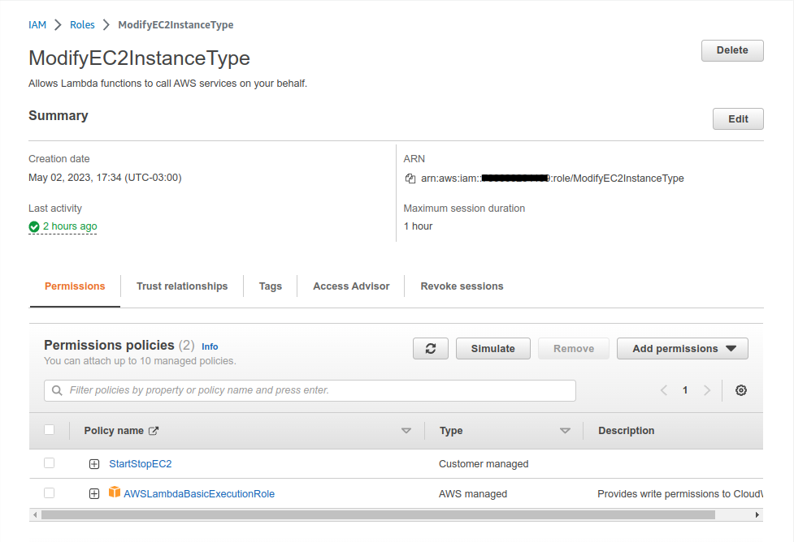

<div style="text-align: justify">

# Automatizar alteração do tipo de instancia EC2 usando funções Lambda e CloudWatch na AWS

<br>

**OBS:** Antes de iniciar, estou considerando que a(s) instância(s) EC2 já esteja(m) criada(s). Na imagem abaixo criei uma EC2 do tipo t2.nano chamada teste_prd:


<br>

## **Passo 1:** Criação da role (função)

<br>

* Criar uma Role do tipo **AWS service** e selecionar o serviço AWS **Lambda**, clicar em **next**


<br>

* Procurar pela policy chamada "AWSLambdaBasicExecutionRole", selecioná-la e clicar em **next**


<br>

* Nesta tela, inserir um nome para a Role, no exemplo foi chamada de "ModifyEC2InstanceType", clicar no final da página em **create role**


<br>

## **Passo 2:** Criação da policy (política)

* Criar uma nova Policy;
    * Selecionar o serviço: EC2;
    * Selecionar Actions e adicionar as seguintes permissões: StartInstances, StopInstances, ModifyInstanceAttribute, DescribeInstances;


<br>

* Selecionar Resources
    * Selecionar **instance**
        * Selecionar **Add ARN**

**OBS:** Deverá ser escolhida a região, conta e instância específica para que a automatização funcione, ou se desejar, poderá selecionar a opçao **qualquer (any)** para aceitar todas as regiões, contas e id's da aws.

* Selecionar **Add**


<br>

* A configuração final de exemplo ficará como a imagem abaixo:


<br>

* Clicar em **Next: Tags** (Adicionar tags se desejar, neste exemplo não foi adicionado)
    * Clicar em **Next: Review**

* Nesta tela informar o nome da policy (no exemplo foi chamada de StartStopEC2)
    * Clicar em **Create policy**


<br>

* A política criada ficará da seguinte forma:


<br>

* Acessar **Roles** pelo console da AWS
    * Selecionar a role que criamos no **passo 1**
    * Em **Permissions** clicar em **Add permissions**
        * Clicar em **Attach policies**
            * Procurar pela política criada acima, no caso do exemplo a política chama-se **StartStopEC2**
                * Depois de selecionada clicar em **Add permissions**

* Por fim a role deverá estar de acordo com a imagem abaixo:



<br>

## **Passo 3:** Criação da função Lambda

* Acessar o recurso Lambda no console da aws
    * Clicar em **Create function**
        * Selecionar **Autor do zero (Author from scratch)**
        * Informar o nome da função, no exemplo ficou como **EC2Modify-t2medium**
        * Em **Tempo de Execução (Runtime)** selecionar **Python 3.9**
        * Selecionar **Architecture (Arquiterura)** **x86_64**
    * Selecionar **Alterar função de execução padrão (Change default execution role)**
        * Selecionar **Use an existing role (Usar uma função existente)**
        * No campo **Função existente (Existing role)** selecionar a role criada no passo 1
    * Clicar em **Create function**


<br>

* Na tela seguinte, na aba **lambda_function** apagar o código atual colar o código python abaixo:

```
import json
import boto3
import time

client = boto3.client('ec2')

def lambda_handler(event, context):

    # Insert your Instance ID here
    my_instance = 'Your instance id '
    
    # Stop the instance
    client.stop_instances(InstanceIds=[my_instance])
    waiter=client.get_waiter('instance_stopped')
    waiter.wait(InstanceIds=[my_instance])
    
    # Change the instance type
    client.modify_instance_attribute(InstanceId=my_instance, Attribute='instanceType', Value='t2.medium')
    
    # Start the instance
    client.start_instances(InstanceIds=[my_instance])
  
    return {
        'statusCode': 200,
        'body': json.dumps('Hello from Lambda!')
    }
```

<br>


<br>

**OBS:**

* As seguintes modificações deverão serem feitas no código python:
    * Alterar campo **Your instance id** para o id da sua instancia
    * Alterar o campo **Instance type** para o tipo de instancia que deseja que a EC2 mude

<br>

* Na aba Configuration clicar em **Edit**
    * Alterar o campo **Timeout** para 2min
    * Clicar em **Save**

>O campo **Timeout** é usado para definir o limite de tempo máximo que uma função Lambda pode ser executada antes que seja interrompida automaticamente. Ao definir um tempo limite para uma função Lambda, você pode garantir que ela seja interrompida automaticamente caso exceda o tempo especificado. Isso pode ajudar a evitar problemas de desempenho e garantir que sua função seja executada dentro dos limites de recursos alocados pela AWS.

<br>


<br>

* Voltar para a aba **Code**
    * Clicar em **Deploy**
    * Caso o precedimento realizado esteja correto, receberemos a seguinte mensagem no topo da tela **"Successfully updated the function EC2StartStopFunction."**

<br>

**OBS:** A função criada irá alterar o tipo de instancia EC2 de **t2.nano** para **t2.medium.** Agora é necessário criar outra função para alterar de **t2.medium** para **t2.nano.** É o mesmo procedimento realizado acima, mas será necessário alterar o campo **Value** do código python para **t2.nano** e inserir um novo nome para a segunda função, por conveniência a chamei de **EC2Modify-t2nano**

<br>

* Depois de criada as duas funções, será mostrada da seguinte forma no recurso Lambda da AWS:


<br>

## **Passo 4:** Criando agendamento no CloudWatch

* Acessar o recurso CloudWatch no console da AWS
    * Clicar em **Events**
        * Clicar em **Rules**
            * Clicar em **Create rule**
                * Em **Event Source** selecionar **Cron expression**
                    * No exemplo foi definido para o evento ser executado todos os dias às 18h:00min
                * Em **Targets** selecionar **Lambda function**
                    * Selecionar uma das funções criadas (no exemplo desejamos que após as 18h:00min o tipo da EC2 para **t2.nano**)
                    * Clicar em **Configure details**


<br>
  
* Na próxima tela informar o nome para a nova rule (No exemplo será chamado de EC2-Modify-t2.nano)
* Clicar em **Create a rule**

<br>

**OBS:** Se faz necessário criar uma segunda rule utilizando o mesmo procedimento acima, para que a instância EC2 volte para o tipo inicial. Quais as alterações dessa segunda rule em comparação com a primeira? 
* Alterar o Cron Expression para que seja ativado às 06h:00min
* Selecionar a função lambda que modifica o tipo de instancia para t2.medium

<br>

* Segue exemplo no imagem abaixo:


<br>

>Caso não sabia como usar expressões cron, essa é uma boa hora de aprender, deixarei um link de uma página que explica o básico sobre o assunto. É fácil.

[Aprendendo_Expressões_Cron](https://acervolima.com/escrevendo-expressoes-cron-para-agendar-tarefas/)

<br>

Pronto! Agora sua EC2 alternará entre o tipo t2.nano e t2.medium diariamente dentro do horário estipulado.

Lembrando que este é um exemplo, você pode fazer o processo com qualquer tipo de instância disponibilizado na AWS.

Outra informação, lembre-se que no momento em que o tipo de instancia for alterado, a EC2 será desligada e depois religada automaticamente.

</div>    